chapter10_减少重复性工作
================

- <a href="#10-减少重复性工作" id="toc-10-减少重复性工作">10
  减少重复性工作</a>
  - <a href="#101-简介" id="toc-101-简介">10.1 简介</a>
  - <a href="#102-迭代" id="toc-102-迭代">10.2 迭代</a>
  - <a href="#103-绘图模板" id="toc-103-绘图模板">10.3 绘图模板</a>
  - <a href="#104-绘图函数" id="toc-104-绘图函数">10.4 绘图函数</a>

# 10 减少重复性工作

## 10.1 简介

- 本章主要介绍三种减少重复性工作的方法。在10.2节中，介绍如何在之前图形的基础上迭代地进行修改，而不是重新输入很多重复性的代码。在10.3节中，介绍如何制作具有重复处理机制，并且只需定义一次就可以多次使用的“绘图模板”。在10.4节中，介绍如何来写可以绘制、修改图形的函数。

## 10.2 迭代

- ggplot2会将你最后一次绘制或者修改的图形储存下来，输入`last_plot()`即可获取该图形。我们可以从一个最基本的图形开始，迭代式地逐步添加图层和调整标度，直到得到最终有意思的结果一这种交互式的工作往往是很有用的。下面的代码展示了将一个我们感兴趣的图形区域逐步放大，并且添加新的图层来突出显示我们发现的有趣信息：x值和y值相同的钻石很少。参见图10.1。

``` r
> library(ggplot2)
> qplot(x,y,data = diamonds,na.rm = TRUE) 
```

<!-- -->

``` r
> last_plot() + xlim(3,11) + ylim(3,11) 
```

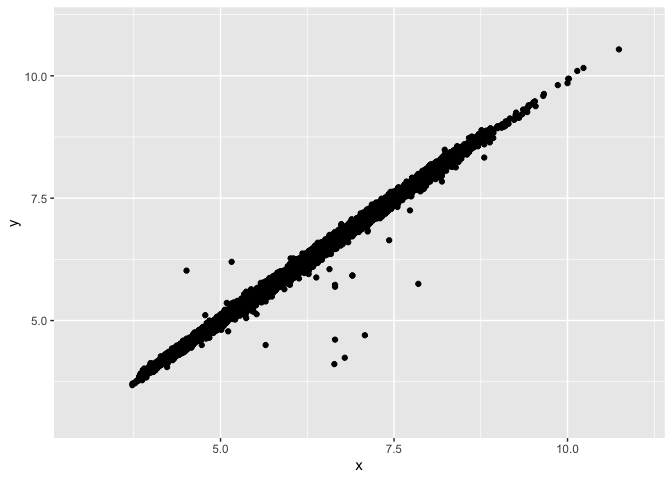<!-- -->

``` r
> last_plot() + xlim(4,10) + ylim(4,10) 
```

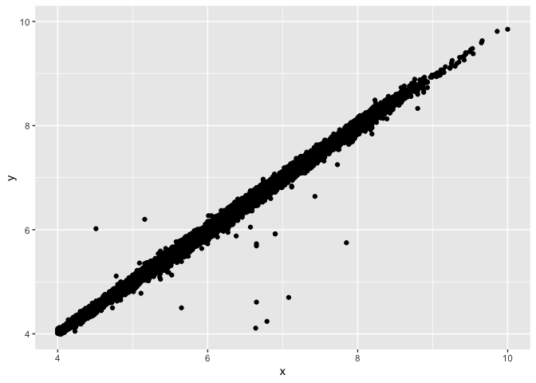<!-- -->

``` r
> last_plot() + xlim(4,5) + ylim(4,5)
```

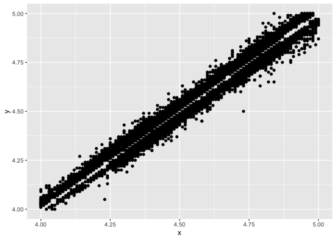<!-- -->

``` r
> last_plot() + xlim(4,4.5) + ylim(4,4.5) 
```

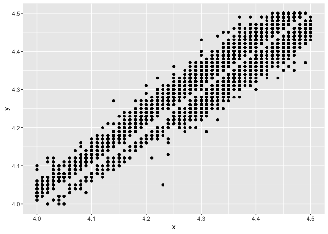<!-- -->

``` r
> last_plot() + geom_abline(colour = "red")
```

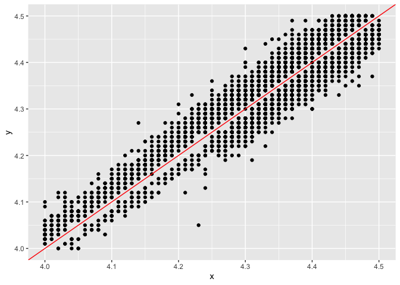<!-- -->

- 图10.1
  当不断放大图形时，交互地使用`last_plot()`可以快速有效地找到最佳视图。最后一张图上添加了一条截距为0斜率为1的直线。图中可以看到数据中没有正方形的钻石。

- 将图形调整至所期望的样子后，最好创建一个能生成最终图形的独立代码，这样的好处在于可以不依赖于之前的步骤：此外，或许还应该添加必要的注释来说明如此绘图的原因。下面是上文中经过交互式修改后得到最终图形的代码。

``` r
> qplot(x,y,data = diamonds,na.rm =T) + geom_abline(colour = "red") + xlim(4,4.5) + ylim(4,4.5)
```

<!-- -->

## 10.3 绘图模板

- ggplot2图形的每一个组件都是一个对象：可以被创建、存储并独立应用于某个图形中。鉴于此，我们可以创建可重用的组件来自动执行某些常用的任务，从而不用多次重复输入冗长的函数。下面的例子创建了一个颜色标度并将其应用在两个图形中，参见图10.2。

``` r
> gradient_rb <- scale_colour_gradient(low = "red",high = "blue") 
> qplot(cty,hwy,data = mpg,colour = displ) + gradient_rb
```

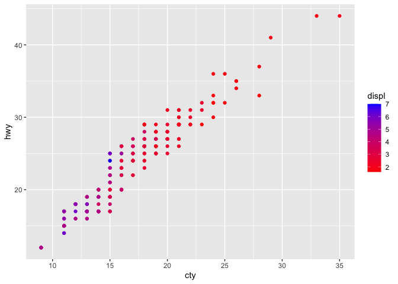<!-- -->

``` r
> qplot(bodywt,brainwt,data = msleep,colour = awake,log = "xy") + gradient_rb
```

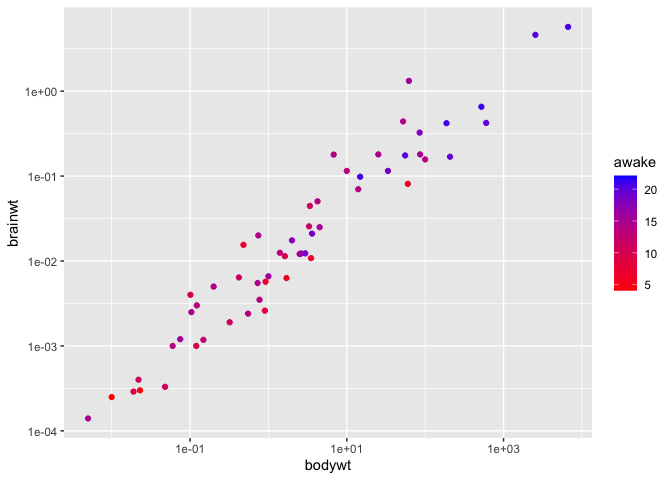<!-- -->

- 图10.2
  将标度存储于某一变量中可供很多图形便捷地调用。对图层和分面也可进行类似地操作。

- 同存储单个对象一样，也可以将ggplot2中的组件存储为list格式的列表。向某个图形中添加组件列表和将其中的组件按顺序逐个添加是一样的效果。下面的例子创建了两个连续标度，用来取消坐标轴标签和刻度。这些对象只需要创建一次，便可应用于很多不同的图形中，代码如下，结果如图10.3所示。

``` r
> # 原书中的NA替换为了NULL,向量c()换成了列表list() 
> xquiet <- scale_x_continuous("",breaks = NULL) 
> yquiet <- scale_y_continuous("",breaks = NULL) 
> quiet <- list(xquiet,yquiet)
> 
> qplot(mpg,wt,data = mtcars) + quiet
```

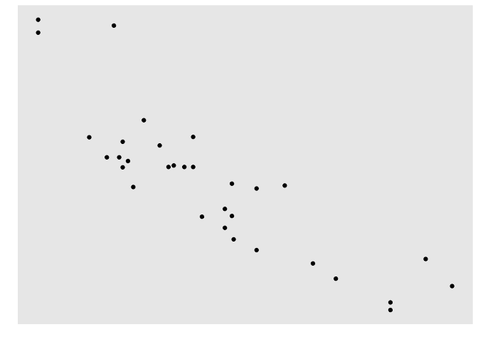<!-- -->

``` r
> qplot(displ,cty,data = mpg) + quiet
```

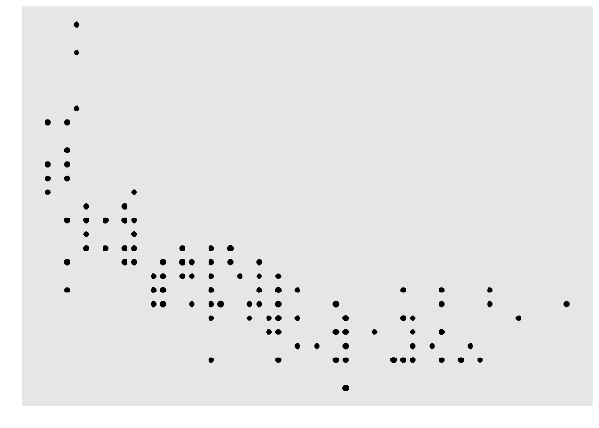<!-- -->

- 图10.3 使用“静默”的x和y标度时，移除了标签并隐藏了刻度和网格线。

- 类似地，创建一个改变图层默认设置的函数也很简单。例如，如果想要创建一个在图形中添加线性模型的函数，代码如下，结果如图10.4所示。

``` r
> library(ggplot2)
> geom_lm <- function(formula=y~x){
+   geom_smooth(formula = formula,se = FALSE,method = "lm")}
> qplot(mpg,wt,data = mtcars) + geom_lm() 
```

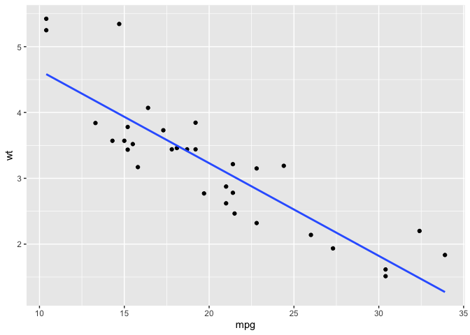<!-- -->

``` r
> library(splines)
> qplot(mpg,wt,data = mtcars) + geom_lm(y ~ ns(x,3))
```

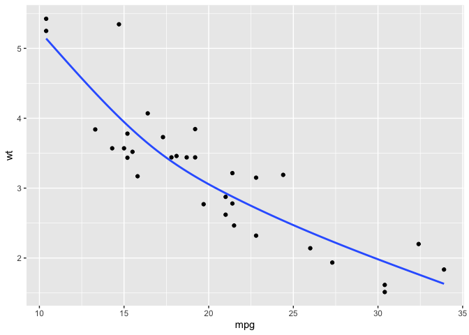<!-- -->

- 图10.4
  创建一个自定义的几何对象函数，用类似（但不相同）的组件创建图形时即可调用。

- 我们定义的函数可以更为复杂，比如在一个列表中包含很多个组件。通过定义此类函数的方式，能够很便捷地画出很复杂的图形。如果我们想用一种特定的方式便捷地创建一个糅合了多种组件的图形，这时候我们就需要写一个“高级”的绘图函数了。接下来介绍这种方法。

## 10.4 绘图函数

- 如果对某一种基本图形，我们反反复复地将其应用到不同的数据集或参数上，这时很有必要将其所有不同的选项封装成一个简单的函数。此外，我们可能还需要进行一些数据的重构或变换，甚至还需要用某个特定的模型来分析数据。此时，我们需要写一个函数来生成ggplot2图形。由于情况可能千差万别，因此很难给出一个处理所有这些问题的建议；不过，这里还是要指出一些很重要，并且必须要考虑的问题。

- 由于是在函数的环境中创建图形，因此以数据框的格式向`ggplot()`传递参数时需要格外小心。此外，还要确保没有在图形属性映射中误用了任何函数的局部变量。

- 若允许用户向图形属性映射中提供自定义变量，建议使用`aes_string()`。该函数作用与`aes()`类似，但它使用字符串而不是未估值的表达式(unevaluated
  expressions)。`aes_string("cty",colour="hwy")`与`aes(cty,colour=hwy)`的功能是一样的，但字符串要比表达式更容易使用。

- 封装函数的一个很好的例子是`qplot()`，如果读者想自己写类似的函数，笔者强烈建议逐行认真阅读`qplot()`函数的源代码，去理解它的工作机理。如果你能以此方式深人学习本书的话，那么你一定会熟练掌握ggplot2所有相关的代码：图海无涯R作舟，统计图形的种类其实很多，困难是如何用R语言去正确地构思并实现。
