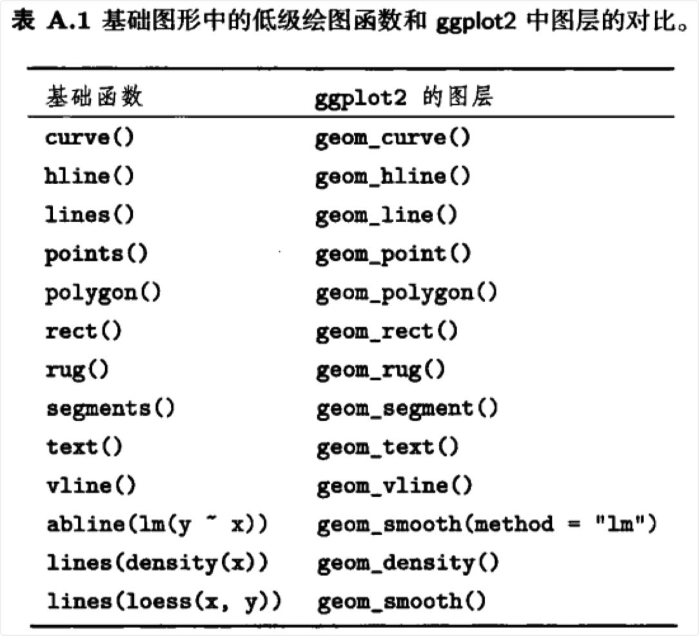

```{r setup, include=FALSE}
knitr::opts_chunk$set(prompt=TRUE,comment='',echo=TRUE,collapse=TRUE,message=FALSE,warning=FALSE)
```

# 附录A 不同语法间的转换

## A.1 简介

-   ggplot2不是孤立存在的，它是R及其他软件的图形工具的发展中的一部分。这一章将介绍如何在ggplot2命令和其他绘图系统之间进行转换。

-   ggplot2中，`qplot()`和`ggplot()`间的语法，见A.2；

-   从基础图形系统转换，见A.3；

-   从lattice图形系统转换，见A.4；

-   从GPL(Graphics Production Library)转换，见A.5。

-   每个部分会给出一些例子，来大致介绍如何在不同类型间进行转换。

## A.2 在gplot和ggplot间转换

-   在ggplot2中，有两种基本绘图方式，`qplot()`和`ggplot()`。`qplot()`可以在很多情况下快速、便捷地使用；但当用多个数据源来设计多个图层的图形时，它就捉襟见肘了。本节将介绍其默认设置，以及它是怎样映射到`gglot()`语法的。

-   默认设置下`qplot()`假定你想要一幅散点图，也就是使用`geom_point()`函数。

```{=html}
<!-- -->
```
    qplot(x,y,data = data) 
    ggplot(data,aes(x,y)) + geom_point()

### A.2.1 图形属性

-   如果需要添加其他图形属性，则它们会被添加在默认设置之上。`qplot()`中，不同的图层之间不能使用不同的图形属性映射或数据源。

```{=html}
<!-- -->
```
    qplot(x,y,data = data,shape = shape,colour = colour) 
    gplot(data,aes(x,y,shape = shape,colour = colour)) + geom_point()

-   `qplot()`中的图形属性参数总是试图将图形属性映射到一个变量上。当参数不是一个变量而是其他值时，该值将会作为新的一列加在原数据集上。如果不想用默认情况，而是要设置某一个图形属性到一个特定值，那么可以在`qplot()`中用`I()`将该值括住，或将其传递为图层的一个参数。4.5.2详细描述了设置和映射的不同。

```{=html}
<!-- -->
```
    qplot(x,y,data = data,colour = I("red")) 
    ggplot(data,aes(x,y)) + geom_point(colour = "red")

### A.2.2 图层

-   改变几何对象参数可以改变添加到图形上的几何对象。

```{=html}
<!-- -->
```
    qplot(x,y,data = data,geom ="line") 
    ggplot(data,aes(x,y)) + geom_line()

-   如果给几何对象参数传递了一个包含了多个几何对象名称的向量，那么每个几何对象将会按次序添加。

```{=html}
<!-- -->
```
    qplot(x,y,data = data,geom =c("point","smooth")) 
    ggplot(data,aes(x,y)) + geom_point() + geom_smooth()

-   和ggplot2中的其他部分不同，统计变换和几何对象是独立的。

```{=html}
<!-- -->
```
    qplot(x,y,data = data,stat = "bin") 
    ggplot(data,aes(x,y)) + geom_point(stat = "bin")

-   任意图层的参数都会传递给所有图层。大部分图层都会忽略对其无用的参数。

```{=html}
<!-- -->
```
    qplot(x,y,data = data,geom = c("point","smooth"),method = "lm") 
    ggplot(data,aes(x,y)) + geom_point(method ="lm") + geom_smooth(method ="lm")

### A.2.3 标度和坐标轴

-   我们可以用xlim、ylim、xlab及ylab来控制x轴和y轴的基本属性。

```{=html}
<!-- -->
```
    qplot(x,y,data = data,xlim =c(1,5),xlab = "my label") 
    ggplot(data,aes(x,y)) + geom_point() + scale_x_continuous("my label",limits = c(1,5))
    qplot(x,y,data = data,xlim = c(1,5),ylim = c(10,20)) 
    ggplot(data,aes(x,y)) + geom_point() + 
      scale_x_continuous(limits = c(1,5)) + scale_y_continuous(limits = c(10,20))

-   同`plot()`一样，`qplot()`可以很方便地对坐标轴进行指数变换。不过有很多变换在`qplot()`是办不到的，更多细节参见6.4.2。

```{=html}
<!-- -->
```
    qplot(x,y,data = data,log="xy") 
    ggplot(data,aes(x,y)) + geom_point() + scale_x_log10() + scale_y_log10()

### A.2.4 绘图选项

-   `qplot()`可以识别很多绘图选项（和`plot()`选项类似），并将它们转换成ggplot2适用的形式。8.1.2列出了所有可能的绘图选项及其作用。

```{=html}
<!-- -->
```
    qplot(x,y,data = data,main = "title",asp =1) 
    ggplot(data,aes(x,y)) + geom_point() + labs(title = "title") + coord_fixed(ratio = 1)

## A.3 基础图形系统

-   基础图形系统中有两类绘图函数，一种是绘制完整的图形，另一种是在现有图形上添加元素；专有名词分别是高级绘图和低级绘图。

### A.3.1 高级绘图

-   `qplot()`是模仿`plot()`设计的，可以完成绝大多数高水平绘图命令的工作。基础图形中只有两种图是ggplot2不能代替的：`filled.contour()`和`persp()`。

```{=html}
<!-- -->
```
    plot(x,y);dotchart(x,y);stripchart(x,y) 
    qplot(x,y)

    plot(x,y,type = "1") 
    qplot(x,y,geom = "line")

    plot(x,y,type = "s") 
    qplot(x,y,geom = "step")

    plot(x,y,type = "b")
    qplot(x,y,geom = c("point","line"))

    boxplot(x,y)
    qplot(x,y,geom = "boxplot")

    hist(x)
    qplot(x,geom = "histogram")

    cdplot(x,y)
    qplot(x,fill = y,geom = "density",position = "fill")

    coplot(y ~ x | a + b) 
    qplot(x,y,facets = a ~ b)

-   这些几何对象的参数和基础图形是不同的。例如，`hist()`的参数是箱子的个数，而`geom_histogram()`的参数则是组距。

```{=html}
<!-- -->
```
    hist(x,bins = 100)
    qplot(x,geom = "histogram",binwidth = 1)

-   `qplot()`的数据格式要求和基础图形也时常有所不同。例如，条形图(bar geom)可适用于没有汇总的数据，`而barplot()`则适用于汇总后的数据。tile和contour这两个几何对象要求数据框形式的参数，而`image()`和`contour()`则需要矩阵形式的参数。

```{=html}
<!-- -->
```
    barplot(table(x)) 
    qplot(x,geom = "bar")

    barplot (x)
    qplot(names(x),x,geom = "bar",stat = "identity")

    image(x)
    qplot(X1,X2,data = melt(x),geom = "tile",fill = value)

    contour(x)
    qplot(X1,X2,data = melt(x),geom = "contour",fill = value)

-   通常情况下，基础绘图函数使用独立的向量，而不像ggplot2使用整合好的数据框。当数据未被指定时，qplot会尝试构建一个数据框，但不能保证总能实现。如果有奇怪的错误产生时，你可能需要自己构建数据框。

```{=html}
<!-- -->
```
    with(df,plot(x,y)) 
    qplot(x,y,data = df)

-   默认时，`qlot()`将以某一标度将数值映射到图形属性中。若需要自行设置图形属性并覆盖默认值，则需使用`I()`。

```{=html}
<!-- -->
```
    plot(x,y,col = "red",cex = 1) 
    qplot(x,y,colour = I("red"),size =I(1))

### A.3.2 低级绘图

-   低级绘图函数将在已有图形上进行添加，这和ggplot2中添加一个新的图层一样，参见表A.1。

```{=html}
<!-- -->
```
    plot(x,y)
    lines(x,y)

    qplot(x,y) + geom_line()

    # 或者：
    qplot(x,y)
    last_plot() + geom_line()



### A.3.3 图例、坐标轴和网格线

- 在ggplot2中，图例和坐标轴是由相关的标度控制的。坐标轴由x和y标度生成，其他的标度来生成图例。具体内容参见图形主题部分：8.1介绍改变坐标轴和图例的外观；6.5介绍如何改变其内容。网格线的展现由grid.major和grid.minor主题选项控制，它们的位置由x和y标度确定。


### A.3.4 调色板

- ggot2每个独立的图形都有各自的标度，而不是使用全局调色板。大多数情况下，可以使用默认的颜色标度（一般都配置了较好的视觉属性）；如果想重复使用某个现存调色板时，可以使用`scale_colour_manual()`来实现。但要格外注意的是，一定要为所绘制的图形选择恰当的颜色！

```
palette(rainbow(5))
plot(1:5,1:5,col=1:5,pch=19,cex=4)

qplot(1:5,1:5,col = factor(1:5),size = I(4))
last_plot() + scale_colour_manual(values = rainbow(5))
```

- 在ggplot2中，你还可以使用连续色彩的调色板，其中的色彩是由线性插值得到的。

```
qplot(0:100,0:100,col=0:100,size=I(4)) + scale_colour_gradientn(colours = rainbow(7)) 
last_plot() + scale_colour_gradientn(colours = terrain.colors(7))
```

### A.3.5 绘图参数

- 基础图形中par函数的大部分选项和ggplot2的主题系统类似，或者是几何对象和标度的默认参数。用`box()`绘制的图形边界可以类似地由panel.background和plot,background主题元素控制。此外，ggplot2图形的标题由title选项控制，而不是`title()`函数。

## A.4 lattice图形设备

- lattice和ggplot2的主要区别在于，lattice的图形公式是基于公式的。而ggplot2并非如此，这是因为公式化不能很好地推广到更复杂的情况中。

```
xyplot(rating ~ year,data = movies) 
qplot(year,rating,data = movies)

xyplot(rating ~ year | Comedy + Action,data = movies)
qplot(year,rating,data = movies,facets = ~ Comedy + Action) 
# 或者：
qplot(year,rating,data = movies,facets = Comedy ~ Action)
```

- lattice中有很多不同的函数来生成不同类型的图形（如同面板参数中的设置)，而ggplot2有`qplot()`。

```
stripplot( ~ rating,data = movies,jitter.data = TRUE) 
qplot(rating,1,data = movies,geom = "jitter")

histogram( ~ rating,data = movies)
qplot(rating,data = movies,geom ="histogram")

bwplot(Comedy ~ rating, data = movies)
qplot(factor(Comedy),rating,data = movies,type = "boxplot")

xyplot(wt ~ mpg,mtcars,type =c("p","smooth"))
qplot(mpg,wt,data = mtcars,geom = c("point","smooth"))

xyplot(wt ~ mpg,mtcars,type =c("p","r"))
qplot(mpg,wt,data = mtcars,geom =c("point","smooth"), method = "lm")
```

- ggplot2和lattice的标度处理处理方式相似，只是在语法上有些不同。

```
xyplot(wt ~ mpg | cyl,mtcars,scales = list(y = list(relation="free"))) 
qplot(mpg,wt,data = mtcars) + facet_wrap(~ cyl,scales = "free")

xyplot(wt ~ mpg | cyl,mtcars,scales = list(log = 10)) 
qplot(mpg,wt,data = mtcars,log ="xy")

xyplot(wt ~ mpg | cyl,mtcars,scales = list(log = 2))
qplot(mpg,wt,data = mtcars) + scale_x_log2() + scale_y_log2()

xyplot(wt ~ mpg,mtcars,group = cyl,auto.key = TRUE) 
# 直接将图形属性映射到颜色、大小、形状等
qplot(mpg,wt,data = mtcars,colour = cyl)

xyplot(wt ~ mpg,mtcars,xlim = c(20,30))
qplot(mpg,wt,data = mtcars,xlim = c(20,30))
```

- lattice和ggplot2中都有类似的选项来控制图形中的标签。

```
xyplot(wt ~ mpg,mtcars, xlab = "Miles per gallon",ylab = "Weight", main = "Weight-efficiency tradeoff")
qplot(mpg,wt,data = mtcars, xlab = "Miles per gallon",ylab = "Weight", main = "Weight-efficiency tradeoff")

xyplot(wt ~ mpg,mtcars,aspect = 1) 
qplot(mpg,wt,data = mtcars,asp =1)
```

- `par.settings()`等同于`+ theme()`，`trellis.options.set()`等同于`theme_set`，`trellis.par.get()`等同于`theme_get()`。

- 更复杂的lattice公式的效果类似于数据重排后再使用ggplot2。
