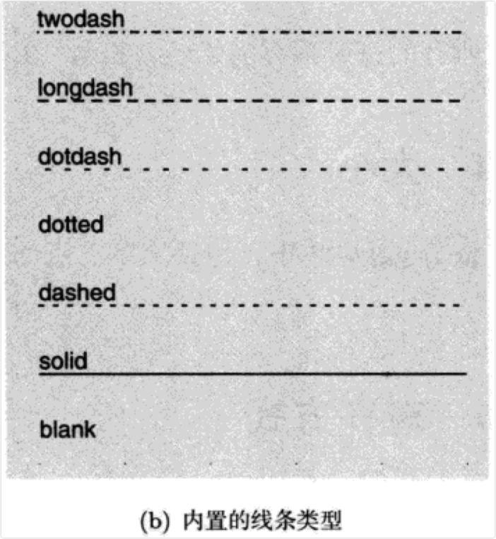
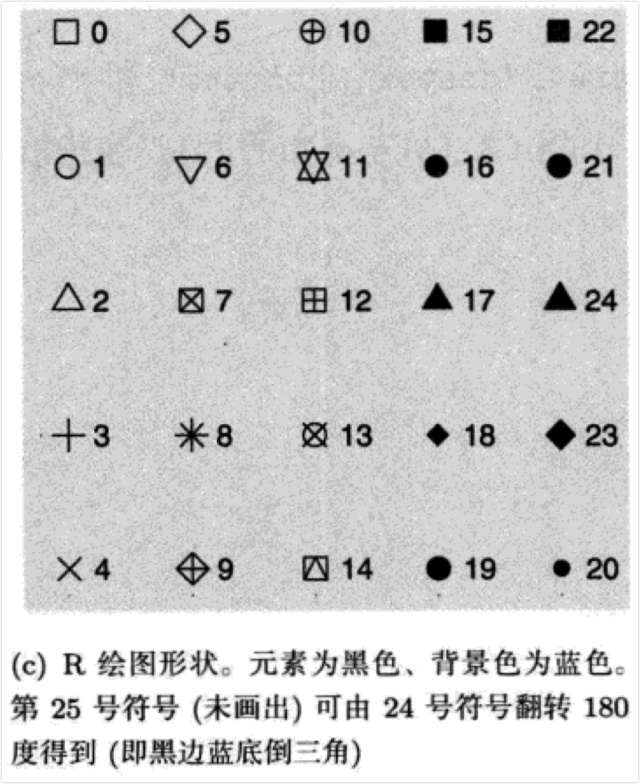
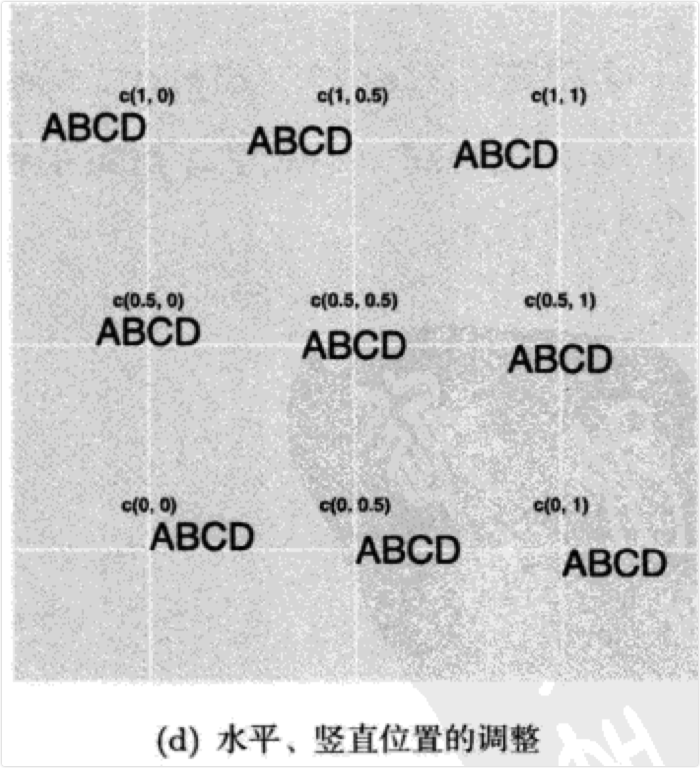

chapter附录B图形属性的定义
================

- <a href="#附录b-图形属性的定义" id="toc-附录b-图形属性的定义">附录B
  图形属性的定义</a>
  - <a href="#b1-颜色" id="toc-b1-颜色">B.1 颜色</a>
  - <a href="#b2-线条类型" id="toc-b2-线条类型">B.2 线条类型</a>
  - <a href="#b3-形状" id="toc-b3-形状">B.3 形状</a>
  - <a href="#b4-大小" id="toc-b4-大小">B.4 大小</a>
  - <a href="#b5-对齐方式" id="toc-b5-对齐方式">B.5 对齐方式</a>

# 附录B 图形属性的定义

- 本章附录对grid绘图函数中用到的各种格式进行了总结。这部分的内容大多零散地分布在R的帮助文档中，这里将这些信息进行了汇总。

## B.1 颜色

- 颜色可按如下方式定义：

- 用名字指定，比如”red”。可以用`colours()`得到详细的颜色列表。

- 用RGB方式指定，形如”#RRGGBB”，其中每对RR，GG和BB都是从OO到FF的一个十六进制数字。我们还可以用`alpha()`来指定部分的透明度，
  比如alpha(“red”,0.5)。

- 用NA指定，表示完全透明色。

- 函数`rgb()`，`hsv()`和`hcl()`可在不同的色彩空间中创建颜色。

## B.2 线条类型

- 线条类型可按如下方式定义：

- 用整数或名字指定：0 = blank，1 = solid，2 = dashed，3 = dotted，4 =
  dotdash，5 = longdash，6 = twodash，如图B.1(b)所示。

- 线条的”开/关”长度模式。由偶数个（最多8个）16进制的数字合起来构成，依次轮流表示”连续线条”和”空白”的长度。比如，字符”33”表示3个单位的连续线条+3个单位的空白（如此循环），“3313”表示3个单位的连续线条+3个单位的空白，然后再接1个单位的连续线条+3个单位的空白（如此循环）。

- 上面描述的5种标准点划线分别对应44，13，134，73和2262。

- 注意：NA不是lty的有效值。

## B.3 形状

- 形状包括4种类型的值：

- \[0,25\]之间的一个整数，如图B.1(c)所示。

- 一个单字符，用该字符作为绘图符号。

- 用一个`.`来绘制最小的可视矩形（如1个像素）。

- NA,不做任何绘制。

- 所有的符号都有前景色，符号19\~25还具有背景色（填充）。

## B.4 大小

- 整个ggplot2中，包括文本、点的大小和线条的宽度，都是以毫米为单位指定的。

## B.5 对齐方式

- 一个字符（或图例）的对齐是在给定范围内对其位置的指定。由两种值来控制水平和竖直对齐。这些值可以是：

- 一个字符：“left”，“right”，“centre”，“center”，“bottom”和”top”。

- 0和1之间的一个数字，指定字符串的位置（从左下角算起）。这些值如图B.1(d)所示。

