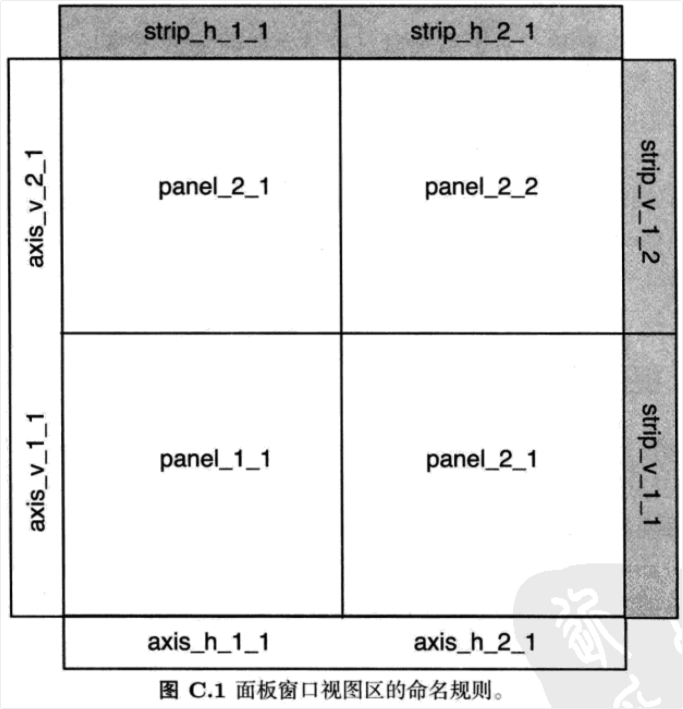
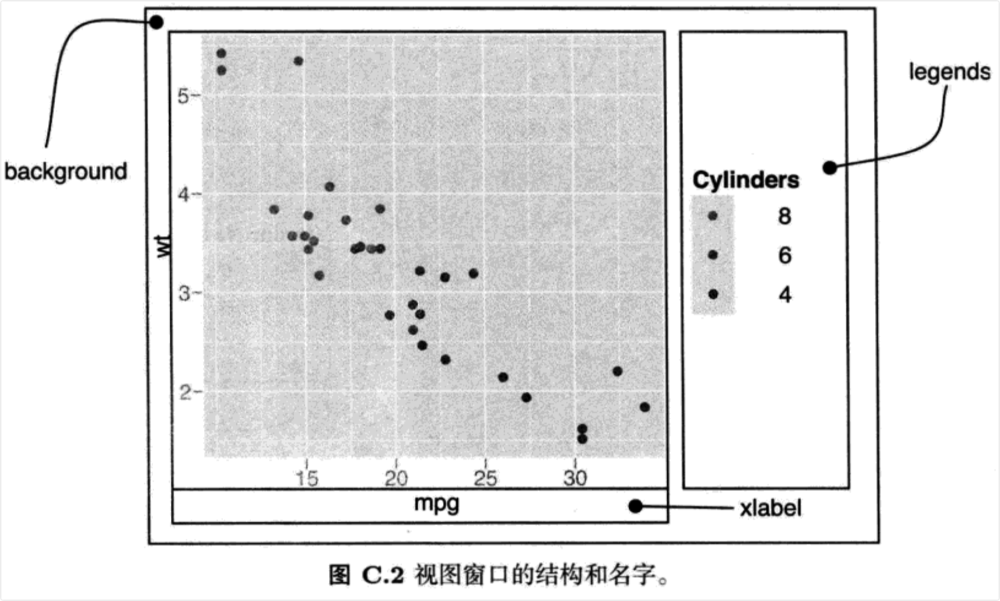
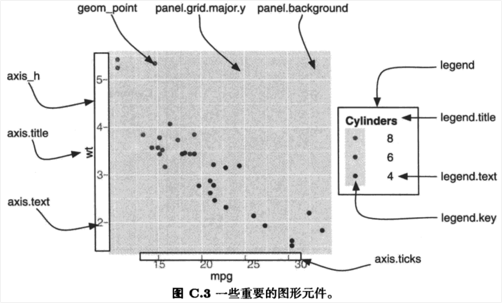
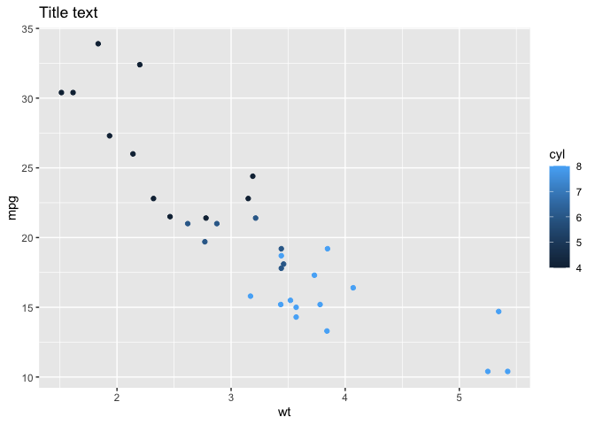

chapter附录C用grid操作图形
================

- <a href="#附录c-用grid操作图形" id="toc-附录c-用grid操作图形">附录C
  用grid操作图形</a>
  - <a href="#c1-简介" id="toc-c1-简介">C.1 简介</a>
  - <a href="#c2-视图窗口" id="toc-c2-视图窗口">C.2 视图窗口</a>
  - <a href="#c3-绘制图形元件" id="toc-c3-绘制图形元件">C.3 绘制图形元件</a>
  - <a href="#c4-保存工作" id="toc-c4-保存工作">C.4 保存工作</a>

# 附录C 用grid操作图形

## C.1 简介

- 有时你需要越过主题系统而直接对底层的gid图形输出进行修改。这时，你需要对grid系统有很好的理解。本附录介绍ggplot2中的重要概念：视图窗口(viewports)和绘图元件(grobs)，尤其是向那些需要和图形元件打交道的朋友。

## C.2 视图窗口

- 视图窗口指定绘图的基本区域。其结构会随图形使用的分面的不同而有细微变化，但是基本区域是相同的。

- 面板视图窗口(panels
  viewports)包括图形的主要部分：条状标签、坐标轴和分面面板。视图窗口是根据它们在图形中的作用和位置来命名的。前缀描述窗口的内容，后跟整数指代x和y的位置（从左下角算起），中间以下划线”\_“分隔开（如下所列）。图C.1表示的是一个2×2图形的命名规则。

- strip_h：水平条状标签

- strip_v：垂直条状标签

- axis_h：水平坐标轴

- axis_v：垂直坐标轴

- panel：面板

- 面板视图窗口包含在背景窗口(background
  viewports)中，背景窗口也包含下列窗口：

- title，xlabel和ylabel：分别指定图形的标题，x轴和y轴的标签。

- legend_box：指定图形的所有图例。



- 图C.2中标出了一些典型的视图窗口的结构和名字。要得到当前图形的所有视图窗口列表，请运行`current.vpTree(all=TRUE)`或`grid.ls(grobs = FALSE,viewports=TRUE)`(注：需加载grid包)。



## C.3 绘制图形元件

- 图形元件名由三部分构成：元件的名字、元件的类及其唯一的数字后缀。这三个部分由”.”拼接组合在一起，比如`title.text.435`，`ticks.segments.15`。这三个组成部分保证了所有的图形元件名都是唯一的，并且可以在同一时间用同样的名字选择多个图形元件。

- 图C.3标出了部分图形元件。这些元件是分层次组织在一起的，但是很难在一个示意图中把这些都表示出来。我们可以在当前窗口下输人`grid.ls()`命令（需加载gid包）来获取当前的图形元件列表。



## C.4 保存工作

- 使用`grid.gedit()`以及类似功能的函数可以修改当前屏幕上的图形，但如果需要将图形存盘就需要额外的步骤；否则你会得到多张图形的输出，每张展示一处图形的变化。这里讲述的关键不是如何修改屏幕上的图形，而是修改背后的图形元件，然后根据修改后的图形元件重新绘制图形。

- 下面给出一个例子：

``` r
> library(ggplot2)
> library(gtable)
> library(grid) # 需要editGrob()函数
> p1 <- qplot(wt,mpg,data = mtcars,colour = cyl,main = "Title text")
> p1
> # 排修改图形元件：图形题目字体改为斜体红色
> g <- ggplotGrob(p1)
> idx <- which(g$layout$name == "title")
> g$grobs[[idx]] <- editGrob(g$grobs[[idx]],gp = gpar(fontface = "italic",col="red"))
> # 重新绘制
> grid.draw(g)
```

<!-- -->

- 另外一种解决方案是在直接修改屏幕上的图形，然后使用`dev.copy2pdf()`以pdf格式保存最终图片。
